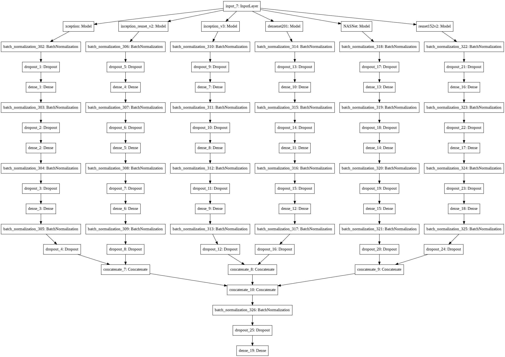

# Auto_tag_images_of_gala
A competition hosted by Hackerearth to auto tag images of gala using various machine learning or deep learning techniques to be more accurate as much we can make it.
I had made my code public here , file named as code.ipynb.
To just view what my model actually looks like , have a look on model.png file.

